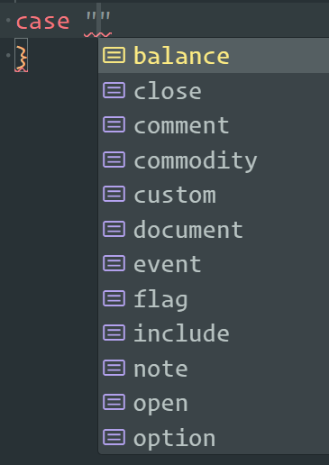

# dts-tree-sitter-beancount

This is a specialized version of `@asgerf/dts-tree-sitter` designed to generate `beancount.d.ts`. That's it.

## Usage

Requires:
- nodejs
- uv
- make

```sh
make beancount.d.ts
```

## Example

grug saw nice kursor example but it confuse grug. grug dunno about kursor. maybe black magic. very scary to grug.
string is simple. grug know how to use string with fancy switch.



you want to find node? you go through tree yourself. it work fine.
